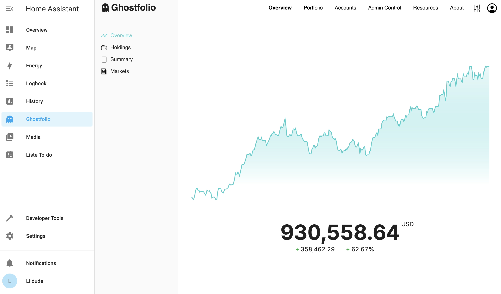

# Home Assistant Add-on: Ghostfolio

Manage your wealth like a boss.

## About

[Ghostfolio][] is a privacy-first, open source dashboard for your personal finances. Break down your asset allocation, know your net worth and make solid, data-driven investment decisions.

This addon allows you to run [Ghostfolio][] on your Home Assistant server based on the the official Ghostfolio [docker image][].

![Supports aarch64 Architecture][aarch64-shield]
![Supports amd64 Architecture][amd64-shield]
![Supports armv7 Architecture][armv7-shield]

| Light Mode                                     | Dark Mode                                    |
| ---------------------------------------------- | -------------------------------------------- |
|  |  |

[Ghostfolio]: https://ghostfol.io
[docker image]: https://hub.docker.com/r/ghostfolio/ghostfolio
[aarch64-shield]: https://img.shields.io/badge/aarch64-yes-green.svg
[amd64-shield]: https://img.shields.io/badge/amd64-yes-green.svg
[armv7-shield]: https://img.shields.io/badge/armv7-yes-green.svg

